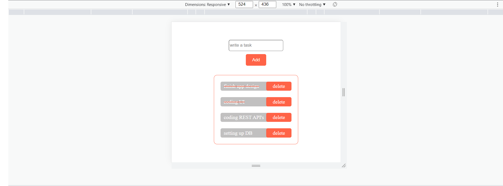

# Todo Simple App with Local Storage

This is an app that i build when i was learning about Local Storage with Js.

## Table of contents

- [Overview](#overview)
  - [The challenge](#the-challenge)
  - [Screenshot](#screenshot)
  - [Links](#links)
- [My process](#my-process)
  - [Built with](#built-with)
- [Author](#author)

## Overview

### The challenge

Users should be able to:

- View the optimal layout for the component depending on their device's screen size
- Add todo, Delete them, and can update thier state (done/not yet)
- Todos must not be lost after refreshing the page.

### Screenshot

-First View

-Mobile View

-Light House Test

-Local Storage

-Local Storage Update

### Links

- Solution URL: [GitHub Repository](https://github.com/nawfelsekrafi/Do-It-Now)
- Live Site URL: [Live Demo](https://nawfelsekrafi.github.io/Do-It-Now/)

## My process

### Built with

- JavaScript ES6
- HTML5
- CSS3
- Flexbox
- CSS Variables

## Author

- LinkedIn - [Nawfel Sekrafi](https://www.linkedin.com/in/nawfel-sekrafi-874167172/)

## Acknowledgments

Thanks God, My Family and Friends xD...
Thank you for your Interest in my Little project ♥😁🖐
